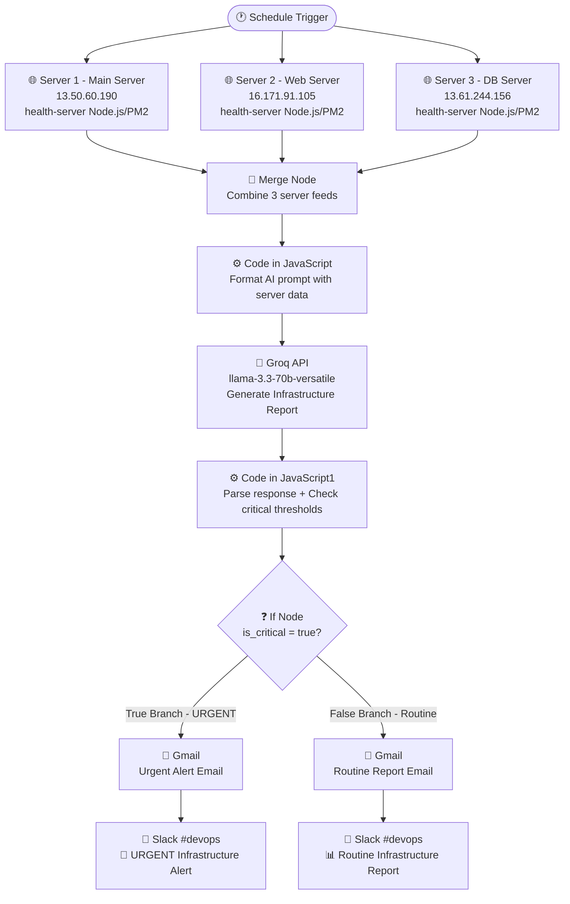

# 🖥️ Multi-Server Infrastructure Monitoring with AI Analysis

An automated infrastructure monitoring system that collects real-time health
data from three AWS EC2 servers, analyzes it using an AI language model (Groq),
and delivers consolidated reports via Gmail and Slack — all orchestrated through n8n.

---

## 📌 Project Overview

This project was built as part of a DevOps portfolio to demonstrate real-world 
skills in infrastructure monitoring, workflow automation, and AI integration. 
The system runs on a schedule, silently collecting server metrics, generating an
intelligent infrastructure report, and alerting the right channels — without any 
manual intervention.

---

## 🏗️ Architecture



---

## 🛠️ Tech Stack

| Tool | Purpose |
|------|---------|
| **AWS EC2** | Cloud infrastructure (3 Ubuntu servers) |
| **n8n** | Workflow automation engine |
| **Docker** | Containerization of n8n and PostgreSQL |
| **PostgreSQL** | n8n database backend |
| **Node.js** | Health server running on each monitored server |
| **PM2** | Process manager for Node.js health servers |
| **Groq API** | AI-powered infrastructure report generation |
| **Llama 3.3 70B** | Language model used for analysis |
| **Gmail** | Email alert delivery |
| **Slack** | Team notification channel (#devops) |

---

## ⚙️ How It Works

### 1. Health Data Collection
A lightweight Node.js HTTP server (`health-server.js`) runs on each of the 
three EC2 instances managed by PM2. It exposes an endpoint that returns 
real-time metrics including:
- CPU usage percentage
- Memory usage (used/total/free MB and percentage)
- Disk usage
- Server uptime
- Hostname and IP address

### 2. Scheduled Triggering
n8n's **Schedule Trigger** fires the workflow at regular intervals. It sends
HTTP GET requests to all three health servers simultaneously.

### 3. Data Merging
The three server responses are combined using n8n's **Merge node** (append mode),
creating a single dataset with all server metrics.

### 4. AI Prompt Construction
A **JavaScript code node** formats the merged server data into a structured 
prompt for the Groq API, requesting a professional 4-5 paragraph consolidated 
infrastructure report comparing all three servers and flagging any concerning values:
- Memory above 80%
- Disk above 85%
- CPU above 80%

### 5. AI Analysis
The formatted prompt is sent to the **Groq API** using the `llama-3.3-70b-versatile`
model. The model returns a detailed infrastructure report with observations and recommendations.

### 6. Report Processing
A second **JavaScript code node** parses the AI response, cleans the formatting, 
and checks whether any critical thresholds were breached, setting an `is_critical` flag.

### 7. Conditional Alerting
The **If node** routes the workflow based on the `is_critical` flag:
- **True branch** → Sends an URGENT alert via Gmail and Slack
- **False branch** → Sends a routine report via Gmail and Slack

---

## 📸 Screenshots

### n8n Workflow Canvas
*(Insert screenshot of full workflow with all nodes)*

### Successful Workflow Execution
*(Insert screenshot of canvas with green checkmarks)*

### Health Servers Running (PM2)
*(Insert screenshot of pm2 status on Server 1)*

### Docker Containers Running
*(Insert screenshot of sudo docker ps -a on Server 2)*

### AI-Generated Report (Groq Output)
*(Insert screenshot of HTTP Request node JSON output)*

### Slack Notification
*(Insert screenshot of Slack #devops channel with full report)*

### Gmail Notification
*(Insert screenshot of email received with infrastructure report)*

### AWS EC2 Instances
*(Insert screenshot of AWS console showing 3 running instances)*

---

## 🚀 Setup Instructions

### Prerequisites
- 3 AWS EC2 instances (Ubuntu 22.04 recommended)
- Docker and Docker Compose installed on the n8n server
- Node.js and PM2 installed on all monitored servers
- Groq API key (free at [console.groq.com](https://console.groq.com))
- Gmail account with OAuth configured in n8n
- Slack workspace with a bot token configured in n8n

### 1. Deploy Health Servers
On each server to be monitored, create and run `health-server.js`:

```bash
npm init -y
npm install express
pm2 start health-server.js --name health-server
pm2 save
pm2 startup
```

The health server listens on port 3000 and returns JSON metrics.

### 2. Deploy n8n with Docker
On your n8n server:

```bash
docker run -d \
  --name n8n \
  --restart always \
  -p 5678:5678 \
  -e DB_TYPE=postgresdb \
  -e DB_POSTGRESDB_HOST=postgres \
  -e DB_POSTGRESDB_DATABASE=n8n \
  -e DB_POSTGRESDB_USER=n8n \
  -e DB_POSTGRESDB_PASSWORD=yourpassword \
  n8nio/n8n
```

### 3. Configure n8n Credentials
In n8n Settings → Credentials, add:
- **Groq API** → Header Auth → `Authorization: Bearer YOUR_GROQ_API_KEY`
- **Gmail OAuth2** → Follow n8n Gmail OAuth setup guide
- **Slack API** → Add your Slack bot token

### 4. Import the Workflow
- In n8n, go to **Workflows → Import**
- Import the workflow JSON file from this repository

### 5. Activate
- Set your desired schedule in the Schedule Trigger node
- Click **Activate** to enable the workflow

---

## 🐛 Challenges & Lessons Learned

### Disk Space Management
During development, the n8n server's root volume filled up completely
(100% usage on an 8GB EBS volume), causing n8n to crash. The fix involved:
- Resizing the AWS EBS volume from 8GB to 20GB via the AWS console
- Running `growpart` and `resize2fs` to extend the filesystem online with zero downtime

### JSON Serialization in n8n
Passing dynamic text data (server health reports with newlines and special characters)
through n8n's HTTP Request node caused persistent JSON validation errors. The solution 
was to:
- Use `JSON.stringify()` in the JavaScript code node to pre-serialize the request body
- Send it as Raw body type with `application/json` content type
- Use `{{ JSON.stringify($json) }}` in the Body field without the `=` prefix

### n8n Data Flow Between Nodes
After the Gmail node executes, it replaces `$json` with Gmail-specific output 
(id, threadId, labelIds), losing the AI summary. The fix was to reference earlier 
nodes directly using:
```
$('Code in JavaScript1').first().json.summary
```

---

## 📊 Sample AI-Generated Report

> *"Consolidated Infrastructure Report: As of the latest monitoring cycle, our
> infrastructure consists of three servers: Server 1 (Main Server), Server 2 (Web Server),
>  and Server 3 (DB Server). This report provides an overview of the health data from
> these servers, highlighting any areas of concern and recommending necessary actions.
>  Overall, the servers are operating within acceptable parameters, with no critical
>  issues detected.*
>
> *A comparison of the servers' resource utilization reveals that Server 2 (Web Server)
> has the highest memory usage, with 71% of its 911MB capacity utilized. While this is
> below the threshold of 80%, it is worth monitoring to prevent potential memory-related issues..."*

---

## 🔮 Future Improvements

- Add more servers to the monitoring pool
- Include database-specific metrics (query performance, connection count)
- Add PagerDuty integration for on-call alerting
- Build a dashboard to visualize historical server health trends
- Implement auto-remediation actions (e.g., restart services when CPU spikes)

---

## 👨‍💻 Author

**Isaac Ambi**
- Portfolio: [thepresentdevopsengineer.cloud](https://thepresentdevopsengineer.cloud)
- LinkedIn: linkedin.com/in/isaac-ambi-012b75135   
- GitHub: https://github/isaacambi.com

---

## 📄 License

This project is open source and available under the [MIT License](LICENSE).
